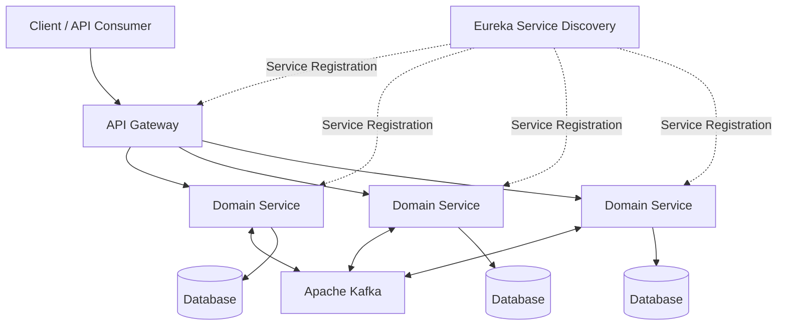

# E-Commerce Microservices

A backend-focused e-commerce application built with **Java & Spring Boot**, designed around **Microservices Architecture**, event-driven communication and distributed system patterns.

The project focuses on building independently deployable services, asynchronous communication with Kafka, service discovery, API routing and resilience patterns commonly used in modern backend systems.

## Tech Stack


## Architecture

The application follows a distributed microservices architecture where services are separated by business responsibility.



## Key Concepts

- Microservices Architecture
- RESTful API development
- API Gateway pattern
- Service Discovery with Eureka
- Event-driven communication with Apache Kafka
- CQRS pattern
- Saga pattern for distributed workflows
- Circuit Breaker / resilience patterns
- Independent service responsibilities
- Asynchronous service communication
- Containerized development environment with Docker
- Distributed system design

## Backend Architecture

### API Gateway

Provides a single entry point for external clients and routes incoming requests to the appropriate microservices.

### Service Discovery

**Eureka** is used for dynamic service registration and discovery, allowing services to communicate without relying on hard-coded locations.

### Event-Driven Communication

**Apache Kafka** is used for asynchronous communication between services.

This helps reduce direct dependencies between microservices and enables loosely coupled workflows.

### CQRS

Command and query responsibilities are separated where appropriate to keep business operations easier to maintain and scale.

### Saga Pattern

Distributed business operations are coordinated using the **Saga pattern**, avoiding traditional transactions across multiple independent services.

### Circuit Breaker

Resilience patterns are used to prevent failures in one service from propagating through the entire system.

## Docker

The services can be containerized and managed together using **Docker Compose**, providing a consistent local development environment.

Example:

```bash
docker-compose up -d
```

To stop the environment:

```bash
docker-compose down
```

## What This Project Demonstrates

This project was built to explore the architecture and engineering challenges involved in distributed backend systems, including:

- Designing independently responsible services
- Managing communication between services
- Handling asynchronous events
- Reducing coupling between backend components
- Building resilient service-to-service communication
- Applying distributed transaction patterns
- Running multiple services in a containerized environment

## Technologies

| Area | Technologies |
|---|---|
| Language | Java |
| Backend | Spring Boot |
| Microservices | Spring Cloud |
| API Routing | API Gateway |
| Service Discovery | Eureka |
| Messaging | Apache Kafka |
| Architecture | Microservices, CQRS, Saga |
| Resilience | Circuit Breaker |
| Containerization | Docker, Docker Compose |
| Communication | REST APIs, Event-Driven Messaging |

---

Developed by **Samet Tunay**

[](https://www.linkedin.com/in/samet-tunay/)
[](https://github.com/samettunay)
